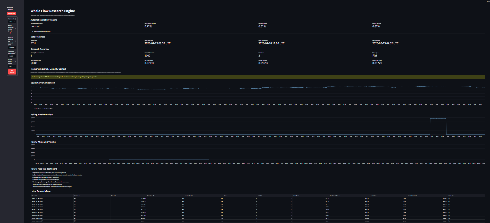

# Crypto Research Engine

[](https://github.com/ArpitPandey9/crypto-research-engine/actions/workflows/ci.yml)

A research-grade crypto whale-flow analysis system that combines on-chain transfer detection, local SQLite storage, price normalization, whale-flow signal generation, liquidity context, benchmark-adjusted outcome validation, persistent validation datasets, vectorized backtesting, automated tests, and an interactive Streamlit dashboard.

This project is built as a flagship proof-of-work system for crypto quant research, DeFi analytics, and protocol-level market structure thinking.

---

## Why This Project Exists

Crypto markets are not driven only by price charts. Large wallets, exchange flows, token transfers, liquidity movement, and whale behavior can create early signals of market pressure.

This project studies a simple but important research question:

> Can large on-chain whale transfers, normalized into USD flow pressure, help explain or signal future asset behavior?

The current research direction is more specific:

> Under what market conditions does whale-flow become decision-useful rather than noise?

Instead of building another price-only dashboard, this project builds a full research pipeline:

```text
on-chain activity
↓
local SQLite vault
↓
historical price normalization
↓
whale-flow signal generation
↓
liquidity and volatility context
↓
benchmark-adjusted outcome validation
↓
persistent outcome-validation dataset
↓
cost-aware backtesting
↓
Streamlit research dashboard
↓
tests + CI validation
```

---

## Current Status

The project currently includes:

* Ethereum whale transaction scanner
* Native ETH transfer detection
* Selected ERC-20 transfer parsing
* Local SQLite database vault
* Binance historical price downloader
* USD normalization of whale volume
* Enriched whale-event table
* Whale-flow signal generation
* Whale-flow mechanism layer design note
* Liquidity depth size-ratio risk helpers
* Property-based liquidity-risk invariant tests
* Flow-context classification helpers
* Dashboard-ready mechanism signal builder
* Real-data mechanism signal adapter
* Real DEX pool-depth client using DEX Screener
* Real DEX pool-depth SQLite ingestion
* Real DEX pool-depth repository access layer
* Rolling net-flow strategy logic
* Cost-aware vectorized backtesting
* Automatic volatility-regime classifier
* Dashboard mechanism-signal integration
* Dashboard data audit script
* Whale-flow stress-test research note
* Outcome validation plan
* Benchmark-adjusted abnormal-return validation helpers
* Evidence-quality and failure-mode interpretation
* Outcome Validation Dataset Engine V2
* Persistent `outcome_validation_records` SQLite dataset table
* Historical Ethereum block backfill script
* Outcome Validation Research Note V2
* Streamlit dashboard
* Unit tests
* Integration tests
* Property-based tests
* Streamlit app tests
* Full pytest discovery in GitHub Actions CI
* Coverage reporting

Current test status:

```text
193 tests passing
91% total coverage
GitHub Actions CI: green
```

---

## System Architecture

```text
src/data/onchain_client.py
↓
scans Ethereum blocks
↓
stores whale transfers in SQLite
↓
data/db/whale_data.db
↓
src/data/fetch_prices.py
↓
downloads ETH/BTC price data
↓
normalizes whale transfers into USD volume
↓
enriched_whales + historical_prices tables
↓
src/strategies/whale_signals.py
↓
creates rolling whale-flow signals
↓
src/analytics/outcome_validation_table.py
↓
validates signals against +6h/+24h outcomes
↓
src/analytics/outcome_validation_dataset.py
↓
persists validated outcomes into outcome_validation_records
↓
scripts/run_outcome_validation.py
↓
prints validation summary and optional dataset summary
↓
app.py
↓
interactive Streamlit dashboard
```

---

## Repository Structure

```text
crypto-research-engine/
├── app.py
├── requirements.txt
├── pytest.ini
├── .coveragerc
├── .github/
│   └── workflows/
│       └── ci.yml
├── data/
│   └── db/
│       └── whale_data.db              # local only, ignored by git
├── docs/
│   ├── QA.md
│   ├── OUTCOME_VALIDATION_DATASET_ENGINE_V2.md
│   ├── OUTCOME_VALIDATION_PLAN.md
│   ├── OUTCOME_VALIDATION_RESULT_NOTE.md
│   ├── OUTCOME_VALIDATION_RESEARCH_NOTE.md
│   ├── OUTCOME_VALIDATION_RESEARCH_NOTE_V2.md
│   ├── STRESS_TEST_NOTE.md
│   └── whale_flow_mechanism_layer.md
├── src/
│   ├── data/
│   │   ├── fetch_prices.py
│   │   ├── onchain_client.py
│   │   ├── dexscreener_client.py
│   │   ├── update_dex_pool_depths.py
│   │   └── pool_depth_repository.py
│   ├── analytics/
│   │   ├── liquidity_risk.py
│   │   ├── flow_context.py
│   │   ├── mechanism_signal.py
│   │   ├── real_mechanism_signal.py
│   │   ├── volatility_regime.py
│   │   ├── outcome_validation.py
│   │   ├── outcome_validation_table.py
│   │   └── outcome_validation_dataset.py
│   └── strategies/
│       ├── run_whale_signals.py
│       └── whale_signals.py
├── scripts/
│   ├── audit_dashboard_data.py
│   ├── backfill_whale_blocks.py
│   └── run_outcome_validation.py
└── tests/
    ├── test_app_streamlit.py
    ├── test_backfill_whale_blocks.py
    ├── test_run_whale_signals_integration.py
    ├── test_run_whale_signals_unit.py
    ├── test_whale_signals.py
    ├── test_whale_signals_properties.py
    ├── test_liquidity_risk.py
    ├── test_liquidity_risk_properties.py
    ├── test_flow_context.py
    ├── test_mechanism_signal.py
    ├── test_real_mechanism_signal.py
    ├── test_volatility_regime.py
    ├── test_dexscreener_client.py
    ├── test_update_dex_pool_depths.py
    ├── test_pool_depth_repository.py
    ├── test_outcome_validation.py
    ├── test_outcome_validation_table.py
    └── test_outcome_validation_dataset.py
```

---

## Core Research Logic

### 1. Whale Transfer Detection

`src/data/onchain_client.py` connects to an Ethereum RPC endpoint and scans block transactions.

It detects large transfers and stores them in a local SQLite database for research.

The goal is not just to download data. The goal is to create a repeatable research vault that can later support stronger protocol-level analytics.

---

### 2. Local SQLite Vault

The project uses SQLite as a local research database.

Main tables:

```text
institutional_transfers
historical_prices
enriched_whales
dex_pool_depths
outcome_validation_records
```

The database file is intentionally ignored by Git:

```text
data/db/*.db
```

This keeps local generated research data out of the public repository.

---

### 3. Price Normalization

`src/data/fetch_prices.py` downloads market price data and normalizes token movement into USD value.

Example idea:

```text
ETH whale amount × ETH price = true USD volume
WBTC whale amount × BTC price = true USD volume
stablecoin amount × 1.0 = true USD volume
```

This converts raw token movement into comparable dollar-denominated flow pressure.

---

### 4. Whale-Flow Signal Generation

`src/strategies/whale_signals.py` builds an hourly research frame.

It calculates:

* target asset price
* hourly whale pressure
* rolling net whale flow
* signal direction

Signal logic:

```text
rolling_net_flow > threshold  → positive signal
rolling_net_flow < -threshold → negative signal
otherwise                     → flat signal
```

The current strategy supports:

```text
ETH
WBTC
```

---

### 5. Liquidity and Mechanism Context

The mechanism layer does not treat whale flow as automatically predictive.

It asks:

```text
How large is the whale flow relative to available liquidity?
Is the volatility regime normal, quiet, or elevated?
Does the market structure support the signal interpretation?
Could the signal be noise?
```

This helps separate:

```text
large transfer alert
```

from:

```text
decision-useful research evidence
```

---

### 6. Outcome Validation

The outcome-validation layer compares a whale-flow signal against post-signal outcomes.

It evaluates:

* +6h actual return
* +6h benchmark return
* +6h abnormal return
* +24h actual return
* +24h benchmark return
* +24h abnormal return
* horizon-level labels
* overall labels
* evidence quality
* failure mode

The benchmark asset is currently BTC.

This means the project does not only ask whether ETH moved. It asks whether ETH moved meaningfully after adjusting for broad crypto market movement.

---

### 7. Outcome Validation Dataset Engine V2

`src/analytics/outcome_validation_dataset.py` converts one-off validation outputs into persistent dataset records.

The V2 dataset layer stores validated outcomes in the local SQLite table:

```text
outcome_validation_records
```

Each persisted record includes:

* event timestamp
* target asset
* benchmark asset
* signal direction
* rolling net flow
* +6h abnormal return
* +24h abnormal return
* overall label
* evidence quality
* failure mode
* data quality status
* validation notes

This allows the project to move from:

```text
one validated sample
```

toward:

```text
many validated observations
```

The research goal is to eventually compare signal reliability across volatility regimes, liquidity conditions, and failure modes.

---

### 8. Backtesting Methodology

The backtest is vectorized with pandas.

Important design choice:

```text
signal observed at hour t
position applied from hour t+1
```

This avoids lookahead bias.

The backtest calculates:

* asset return
* shifted strategy position
* trade flag
* transaction cost
* gross strategy return
* net strategy return
* buy-and-hold equity curve
* gross strategy equity curve
* net strategy equity curve

Transaction cost is charged when the position changes.

---

## Streamlit Dashboard



The dashboard is implemented in:

```text
app.py
```

It provides:

* target asset selection
* rolling window control
* minimum flow threshold control
* transaction cost control
* data freshness panel
* research summary metrics
* equity curve comparison
* rolling whale-flow chart
* hourly whale-volume chart
* latest research rows
* signal distribution table
* mechanism-signal interpretation
* volatility-regime context

Run it with:

```bash
streamlit run app.py
```

---

## How To Run Locally

### 1. Clone the repository

```bash
git clone https://github.com/ArpitPandey9/crypto-research-engine.git
cd crypto-research-engine
```

### 2. Create and activate a virtual environment

```bash
python -m venv .venv
source .venv/bin/activate
```

On Windows PowerShell:

```powershell
.venv\Scripts\Activate.ps1
```

### 3. Install dependencies

```bash
pip install -r requirements.txt
```

### 4. Configure environment variables

Create a local `.env` file:

```text
ETH_RPC_URL=your_ethereum_rpc_url_here
```

Do not commit `.env`.

---

## Data Pipeline Commands

### 1. Scan Ethereum data

```bash
python -m src.data.onchain_client
```

### 2. Download prices and normalize whale volume

```bash
python -m src.data.fetch_prices
```

### 3. Update DEX pool-depth context

```bash
python -m src.data.update_dex_pool_depths
```

### 4. Run whale-flow strategy summary

```bash
python -m src.strategies.run_whale_signals
```

### 5. Backfill historical Ethereum blocks

```bash
python scripts/backfill_whale_blocks.py --latest-blocks 100 --min-usd-value 100000 --sleep-seconds 0.1
```

### 6. Run outcome validation

```bash
python scripts/run_outcome_validation.py --target-asset ETH --benchmark-asset BTC --window-hours 12 --min-flow-usd 0
```

### 7. Persist outcome-validation records

```bash
python scripts/run_outcome_validation.py --target-asset ETH --benchmark-asset BTC --window-hours 12 --min-flow-usd 0 --save-dataset --validation-notes "Initial V2 dataset persistence run"
```

### 8. Launch dashboard

```bash
streamlit run app.py
```

---

## Testing

Run the full test suite:

```bash
python -m pytest -q
```

Run tests with coverage:

```bash
coverage erase
coverage run -m pytest -q
coverage report
```

Current local result:

```text
193 passed
91% total coverage
```

---

## Dashboard Data Audit

The repository includes a local audit script that independently recomputes dashboard numbers from the SQLite database and project formulas.

Audit command:

```bash
python scripts/audit_dashboard_data.py --target-asset ETH --window-hours 36 --min-flow-usd 10000 --cost-per-trade 0.0015 --manual-volatility-regime normal
```

Current ETH audit result:

* Dashboard numbers are recomputed from SQLite and project formulas.
* Automatic volatility regime is available.
* Latest rolling whale-flow is zero, so no fake pool-impact signal is generated.

If the local database has no real whale-event rows for an asset, the audit stops honestly instead of fabricating strategy numbers.

Current WBTC audit result:

* No whale events found for target_asset=WBTC.
* Audit stopped honestly instead of generating fake strategy numbers.

---

## Research Notes

* [Outcome Validation Plan v1](docs/OUTCOME_VALIDATION_PLAN.md) defines how whale-flow classifications will be tested against +6h/+24h outcomes, BTC benchmark-adjusted abnormal returns, evidence quality, and failure-mode interpretation.
* [Outcome Validation Result Note v1](docs/OUTCOME_VALIDATION_RESULT_NOTE.md) records the first real ETH validation sample, where a positive whale-flow signal failed after BTC benchmark adjustment and was classified as strong evidence with an unsupported_signal failure mode.
* [Outcome Validation Research Note v1](docs/OUTCOME_VALIDATION_RESEARCH_NOTE.md) summarizes the first validation result as a short research note with hypothesis, signal tested, result, interpretation, limitations, and next improvement.
* [Outcome Validation Research Note V2](docs/OUTCOME_VALIDATION_RESEARCH_NOTE_V2.md) summarizes the first small outcome-validation dataset: 11 stored records, 10 testable records, 1 worked signal, 7 failed signals, 2 short-lived reversal cases, and a 10.00% support rate.
* [Outcome Validation Results](docs/RESULTS.md) summarizes the public V2 result table and links to the case-level CSV sample.
* [Event-Time Market Context V3](docs/EVENT_TIME_CONTEXT_V3.md) explains the prior-only volatility/liquidity context layer and links to the V3 case-level sample at `data/samples/event_time_context_v3_sample.csv`.
* [Outcome Validation Dataset Engine V2](docs/OUTCOME_VALIDATION_DATASET_ENGINE_V2.md) defines the persistent SQLite dataset layer for storing validated whale-flow outcomes across multiple events.
* [Whale-Flow Stress Test Note v1](docs/STRESS_TEST_NOTE.md) explains how the whale-flow signal is being evaluated beyond a basic dashboard, including failure modes, liquidity absorption risk, volatility context, and decision-useful interpretation.

---

## Outcome Validation Layer

The project includes a benchmark-adjusted outcome-validation layer.

This layer compares whale-flow signal direction against +6h and +24h post-signal outcomes, adjusts asset movement against a BTC benchmark using abnormal return, and classifies the result with:

* horizon-level labels
* overall labels
* evidence-quality labels
* failure-mode interpretation

This helps the system move from a plausible signal framework toward a more testable research framework.

---

## Outcome Validation Runner

Run the real SQLite-based outcome-validation summary:

```bash
python scripts/run_outcome_validation.py --target-asset ETH --benchmark-asset BTC --window-hours 12 --min-flow-usd 0
```

Persist validation rows into the reusable SQLite dataset:

```bash
python scripts/run_outcome_validation.py --target-asset ETH --benchmark-asset BTC --window-hours 12 --min-flow-usd 0 --save-dataset --validation-notes "Initial V2 dataset persistence run"
```

First recorded ETH sample result (v1):

* signal direction: positive
* rolling net whale flow: $1,899,322.81
* +6h abnormal return: -0.1946%
* +6h label: failed
* +24h abnormal return: -0.0977%
* +24h label: failed
* overall label: failed
* evidence quality: strong
* failure mode: unsupported_signal
* dataset record count: 1
* dataset support rate: 0.00%

This means the first real ETH whale-flow sample was not supported after BTC benchmark adjustment.

The project records this honestly as research evidence, not as a guaranteed prediction.

V2 dataset summary:

* stored validation records: 11
* testable records: 10
* worked: 1
* failed: 7
* reversal / short-lived reaction: 2
* data unavailable: 1
* support rate: 10.00%

This means the first small ETH positive whale-flow dataset does not support a simple claim that whale-flow reliably predicts durable BTC-adjusted outperformance.


---

## CI/CD

GitHub Actions runs the full test suite and coverage workflow on every push and pull request to `main`.

Workflow file:

```text
.github/workflows/ci.yml
```

CI currently validates:

* unit tests
* integration tests
* property-based tests
* Streamlit app tests
* coverage report
* coverage artifact upload

---

## Security Practices

This project follows basic security hygiene:

* `.env` is ignored
* database files are ignored
* coverage artifacts are ignored
* virtual environment is ignored
* secrets are never committed
* RPC URLs are loaded from environment variables

Important rule:

> Never commit private keys, API keys, RPC secrets, or wallet credentials.

---

## Current Limitations

This is a research prototype, not a production trading system.

Current limitations:

* scans limited Ethereum data depending on the current script configuration
* does not yet perform continuous historical block indexing
* supports selected assets only
* the local database may not contain whale-event rows for every supported UI asset
* does not yet parse all event logs or internal DeFi contract flows
* local SQLite database is not committed to GitHub
* dashboard depends on locally generated database tables
* local SQLite outcome-validation records are not committed to GitHub
* latest local V2 research run reached 11 stored records and 10 testable records, summarized in Outcome Validation Research Note V2
* event-time volatility context is attached to validation records in V3
* current V3 liquidity context is mostly stale, so flow-to-liquidity impact claims remain unavailable until historical liquidity backfill or a transparent liquidity proxy is added
* signals are research signals, not financial advice

---

## Roadmap

Near-term improvements:

* add historical liquidity backfill or a transparent event-time liquidity proxy
* analyze support rate by volatility regime using V3 event-time context
* analyze support rate by fresh liquidity context once reliable event-time liquidity exists
* test whether short-lived reactions are linked to liquidity, volatility, or benchmark outperformance
* continue avoiding feature drift
* keep improving protocol-level understanding through Solidity and Foundry

Future research extensions:

* exchange inflow/outflow classification
* destination-type classification
* liquidation-risk monitoring
* DeFi yield and liquidity dashboard
* multi-chain whale-flow ingestion
* smart-contract state analytics
* Foundry-based protocol simulation module

---

## Interview Explanation

A clear way to explain this project:

> This is a crypto research engine that detects large on-chain transfers, stores them in a local SQLite vault, normalizes token movement into USD volume using market prices, converts that movement into rolling whale-flow signals, validates those signals against benchmark-adjusted future outcomes, stores the validation results in a reusable SQLite research dataset, and presents the results through a tested Streamlit dashboard.

In simple terms:

> It studies when whale behavior becomes a useful research signal, when it becomes noise, and under what market conditions that difference matters.

---

## Disclaimer

This project is for research and education only.

It is not financial advice, not a trading recommendation system, and not a production investment product.

## Context-Conditioned Outcome Analysis V4

V4 adds a grouped reliability layer on top of the V3 event-time context records.

V2 validated whether positive ETH whale-flow signals worked, failed, reversed, or became unavailable after BTC benchmark adjustment.

V3 attached prior-only volatility and liquidity context to each validated record.

V4 summarizes those records by context bucket, volatility regime, and liquidity status, then calculates worked, failed, reversal, and data-unavailable counts.

Current V4 artifacts:

- [Context-Conditioned Outcome Analysis Plan](docs/CONTEXT_CONDITIONED_OUTCOME_PLAN.md)
- `src/analytics/context_conditioned_outcomes.py`
- `tests/test_context_conditioned_outcomes.py`
- `scripts/run_context_conditioned_outcomes.py`
- `data/samples/context_conditioned_outcomes_v4_sample.csv`

Current V4 sample finding:

- 11 V3 records were grouped into 9 V4 summary rows.
- `volatility_only_context` contains 9 records: 1 worked, 6 failed, and 2 reversed.
- `extreme` volatility contains 7 records: 1 worked and 6 failed.
- `elevated` volatility contains 2 records, both reversal outcomes.
- Liquidity status is mostly stale, so the project still avoids strong liquidity-impact claims.

Current local verification:

- 193 tests passing
- 91% total coverage

V4 does not claim causality. It provides an honest context-conditioned reliability summary and identifies the next data gap: fresher event-time liquidity.
