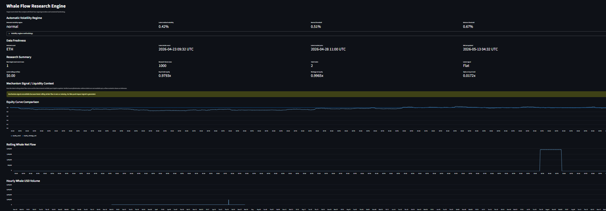

# Crypto Research Engine

[](https://github.com/ArpitPandey9/crypto-research-engine/actions/workflows/ci.yml)

[Portfolio](https://arpitpandey9.github.io) · [GitHub Profile](https://github.com/ArpitPandey9)

**On-chain whale-flow research engine for crypto market structure, DeFi liquidity context, and benchmark-adjusted signal validation.**

This project tests whether large on-chain whale-flow events become decision-useful under specific market conditions, instead of assuming that whale transfers automatically create reliable price signals.

It combines on-chain transfer detection, USD normalization, whale-flow signal generation, volatility context, DEX liquidity context, BTC benchmark-adjusted outcome validation, persistent validation datasets, backtesting, automated tests, and a Streamlit research dashboard.

---

## Current Research Finding

The current validation results suggest that **positive ETH whale-flow should not be treated as a standalone durable signal**.

In the first real validation samples, positive ETH whale-flow often failed or reversed after adjusting ETH performance against the BTC benchmark. This means ETH sometimes moved up in raw price, but did not outperform broader crypto market movement.

The project therefore treats whale-flow as a **testable hypothesis**, not as proof of price impact.

Liquidity interpretation is also intentionally conservative. Current V3/V4 liquidity context is often stale or unavailable, so the project does **not** calculate misleading flow-to-liquidity ratios or make strong liquidity-impact claims when event-time DEX liquidity is not fresh.

---

## What This Project Tests

This project studies one core research question:

> Under what market conditions does whale-flow become decision-useful rather than noise?

The pipeline is designed to answer that question through:

~~~text
on-chain whale movement
↓
USD-normalized flow pressure
↓
rolling whale-flow signal
↓
volatility and liquidity context
↓
BTC benchmark-adjusted outcome validation
↓
worked / failed / reversal / unavailable classification
↓
context-conditioned V4 analysis
~~~

---

## What This Project Does Not Claim

This project does **not** claim that:

* whale transfers always cause price movement
* every large transfer is a buy or sell
* DEX liquidity proves exact market impact
* stale liquidity can support flow-to-liquidity impact ratios
* BTC is a perfect benchmark for all crypto market movement
* this is a production trading system or financial advice

Instead, it separates:

~~~text
observed movement
derived signal
market context
validated outcome
research limitation
~~~

That separation is the main research discipline of the project.

---

## Proof and Reproducibility Status

Current status:

~~~text
214 tests passing
91% total coverage
GitHub Actions CI: green
~~~

The repository includes:

* on-chain transfer scanning
* local SQLite research database
* ETH/BTC price normalization
* rolling whale-flow signal generation
* BTC-adjusted abnormal-return validation
* +6h and +24h outcome classification
* persistent outcome-validation dataset
* V3 event-time volatility and liquidity context
* V4 context-conditioned outcome analysis
* stale-liquidity safeguards
* Streamlit dashboard
* automated unit, integration, property-based, and dashboard tests

---

## Key Research Notes

Start here:

* [Outcome Validation Plan](docs/OUTCOME_VALIDATION_PLAN.md)
* [Outcome Validation Result Note](docs/OUTCOME_VALIDATION_RESULT_NOTE.md)
* [Outcome Validation Research Note V2](docs/OUTCOME_VALIDATION_RESEARCH_NOTE_V2.md)
* [Event-Time Context V3](docs/EVENT_TIME_CONTEXT_V3.md)
* [Context-Conditioned Outcome Plan](docs/CONTEXT_CONDITIONED_OUTCOME_PLAN.md)
* [Context-Conditioned Outcome Research Note V4](docs/CONTEXT_CONDITIONED_OUTCOME_RESEARCH_NOTE_V4.md)
* [QA / Project Defense Notes](docs/QA.md)
* [WETH9 Event-Level Verification Case Study](docs/WETH9_EVENT_LEVEL_VERIFICATION.md)

---

## Protocol Verification Case Study — WETH9

A separate fixed-window investigation applies the same evidence-first research discipline at protocol-execution level rather than market-signal level.

For **135** WETH9 calls of at least **1,000 ETH** in the 23 Apr–22 Jul 2026 window:

- **135 / 135** matched a WETH9 `Deposit` event;
- **135 / 135** matched transaction value to event value in exact wei;
- **135 / 135** matched transaction sender to Deposit destination;
- **128** used selector-only calldata and **7** carried trailing bytes;
- the seven trailing-calldata cases resolved into **3 observed patterns** without semantic or entity over-attribution.

[Read the case study](docs/WETH9_EVENT_LEVEL_VERIFICATION.md) · [Open the Dune dashboard](https://dune.com/arpitpandey/weth9-large-deposits-event-level-verification)

---

## System Architecture

```text
src/data/onchain_client.py
↓
scans Ethereum blocks
↓
stores whale transfers in SQLite
↓
data/db/whale_data.db
↓
src/data/fetch_prices.py
↓
downloads ETH/BTC price data
↓
normalizes whale transfers into USD volume
↓
enriched_whales + historical_prices tables
↓
src/strategies/whale_signals.py
↓
creates rolling whale-flow signals
↓
src/analytics/outcome_validation_table.py
↓
validates signals against +6h/+24h outcomes
↓
src/analytics/outcome_validation_dataset.py
↓
persists validated outcomes into outcome_validation_records
↓
scripts/run_outcome_validation.py
↓
prints validation summary and optional dataset summary
↓
app.py
↓
interactive Streamlit dashboard
```

---

## Repository Structure

The repository is organized around a tested research pipeline: data ingestion, signal generation, outcome validation, event-time context, context-conditioned analysis, documentation, and sample outputs.

### Application and configuration

- `app.py`
- `requirements.txt`
- `pytest.ini`
- `.coveragerc`
- `.github/workflows/ci.yml`

### Research documentation

- `docs/CONTEXT_CONDITIONED_OUTCOME_PLAN.md`
- `docs/CONTEXT_CONDITIONED_OUTCOME_RESEARCH_NOTE_V4.md`
- `docs/EVENT_TIME_CONTEXT_V3.md`
- `docs/OUTCOME_VALIDATION_DATASET_ENGINE_V2.md`
- `docs/OUTCOME_VALIDATION_PLAN.md`
- `docs/OUTCOME_VALIDATION_RESEARCH_NOTE.md`
- `docs/OUTCOME_VALIDATION_RESEARCH_NOTE_V2.md`
- `docs/OUTCOME_VALIDATION_RESULT_NOTE.md`
- `docs/QA.md`
- `docs/RESULTS.md`
- `docs/STRESS_TEST_NOTE.md`
- `docs/whale_flow_mechanism_layer.md`
- `docs/WETH9_EVENT_LEVEL_VERIFICATION.md`

### Public sample outputs

- `data/samples/context_conditioned_outcomes_v4_sample.csv`
- `data/samples/event_time_context_v3_sample.csv`
- `data/samples/outcome_validation_v2_sample.csv`

### Data ingestion modules

- `src/data/dexscreener_client.py`
- `src/data/fetch_prices.py`
- `src/data/onchain_client.py`
- `src/data/pool_depth_repository.py`
- `src/data/update_dex_pool_depths.py`

### Analytics modules

- `src/analytics/context_conditioned_outcomes.py`
- `src/analytics/event_time_context.py`
- `src/analytics/flow_context.py`
- `src/analytics/liquidity_risk.py`
- `src/analytics/mechanism_signal.py`
- `src/analytics/outcome_validation.py`
- `src/analytics/outcome_validation_dataset.py`
- `src/analytics/outcome_validation_table.py`
- `src/analytics/real_mechanism_signal.py`
- `src/analytics/volatility_regime.py`

### Strategy modules

- `src/strategies/__init__.py`
- `src/strategies/run_whale_signals.py`
- `src/strategies/whale_signals.py`

### Scripts

- `scripts/audit_dashboard_data.py`
- `scripts/backfill_whale_blocks.py`
- `scripts/run_context_conditioned_outcomes.py`
- `scripts/run_outcome_validation.py`

### Tests

- `tests/test_app_streamlit.py`
- `tests/test_backfill_whale_blocks.py`
- `tests/test_context_conditioned_outcomes.py`
- `tests/test_dexscreener_client.py`
- `tests/test_event_time_context.py`
- `tests/test_flow_context.py`
- `tests/test_liquidity_risk.py`
- `tests/test_liquidity_risk_properties.py`
- `tests/test_mechanism_signal.py`
- `tests/test_outcome_validation.py`
- `tests/test_outcome_validation_dataset.py`
- `tests/test_outcome_validation_table.py`
- `tests/test_pool_depth_repository.py`
- `tests/test_real_mechanism_signal.py`
- `tests/test_run_whale_signals_integration.py`
- `tests/test_run_whale_signals_unit.py`
- `tests/test_update_dex_pool_depths.py`
- `tests/test_volatility_regime.py`
- `tests/test_whale_signals.py`
- `tests/test_whale_signals_properties.py`

---

## Core Research Logic

### 1. Whale Transfer Detection

`src/data/onchain_client.py` connects to an Ethereum RPC endpoint and scans block transactions.

It detects large transfers and stores them in a local SQLite database for research.

The goal is not just to download data. The goal is to create a repeatable research data store that can later support stronger protocol-level analytics.

---

### 2. Local SQLite Data Store

The project uses SQLite as a local research database.

Main tables:

```text
institutional_transfers
historical_prices
enriched_whales
dex_pool_depths
outcome_validation_records
```

The database file is intentionally ignored by Git:

```text
data/db/*.db
```

This keeps local generated research data out of the public repository.

---

### 3. Price Normalization

`src/data/fetch_prices.py` downloads market price data and normalizes token movement into USD value.

Example idea:

```text
ETH whale amount × ETH price = true USD volume
WBTC whale amount × BTC price = true USD volume
stablecoin amount × 1.0 = true USD volume
```

This converts raw token movement into comparable dollar-denominated flow pressure.

---

### 4. Whale-Flow Signal Generation

`src/strategies/whale_signals.py` builds an hourly research frame.

It calculates:

* target asset price
* hourly whale pressure
* rolling net whale flow
* signal direction

Signal logic:

```text
rolling_net_flow > threshold  → positive signal
rolling_net_flow < -threshold → negative signal
otherwise                     → flat signal
```

The current strategy supports:

```text
ETH
WBTC
```

---

### 5. Liquidity and Mechanism Context

The mechanism layer does not treat whale flow as automatically predictive.

It asks:

```text
How large is the whale flow relative to available liquidity?
Is the volatility regime normal, quiet, or elevated?
Does the market structure support the signal interpretation?
Could the signal be noise?
```

This helps separate:

```text
large transfer alert
```

from:

```text
decision-useful research evidence
```

---

### 6. Outcome Validation

The outcome-validation layer compares a whale-flow signal against post-signal outcomes.

It evaluates:

* +6h actual return
* +6h benchmark return
* +6h abnormal return
* +24h actual return
* +24h benchmark return
* +24h abnormal return
* horizon-level labels
* overall labels
* evidence quality
* failure mode

The benchmark asset is currently BTC.

This means the project does not only ask whether ETH moved. It asks whether ETH moved meaningfully after adjusting for broad crypto market movement.

---

### 7. Outcome Validation Dataset Engine V2

`src/analytics/outcome_validation_dataset.py` converts one-off validation outputs into persistent dataset records.

The V2 dataset layer stores validated outcomes in the local SQLite table:

```text
outcome_validation_records
```

Each persisted record includes:

* event timestamp
* target asset
* benchmark asset
* signal direction
* rolling net flow
* +6h abnormal return
* +24h abnormal return
* overall label
* evidence quality
* failure mode
* data quality status
* validation notes

This allows the project to move from:

```text
one validated sample
```

toward:

```text
many validated observations
```

The research goal is to eventually compare signal reliability across volatility regimes, liquidity conditions, and failure modes.

---

### 8. Backtesting Methodology

The backtest is vectorized with pandas.

Important timing design (V5 causal methodology):

```text
hourly bucket t completes
signal_available_at = bucket end
position enters at the next bar open
returns are measured from that executable open forward
```

The earlier close-to-close shifted implementation is retained only for historical-methodology reproducibility. The active research path uses explicit signal availability plus next-open execution so the price used to finalize a signal is not also assumed to be an already-executable entry price.

The backtest calculates:

* asset return
* shifted strategy position
* trade flag
* transaction cost
* gross strategy return
* net strategy return
* buy-and-hold equity curve
* gross strategy equity curve
* net strategy equity curve

Transaction cost is charged when the position changes.

---

## Streamlit Dashboard



The dashboard is implemented in:

```text
app.py
```

It provides:

* target asset selection
* rolling window control
* minimum flow threshold control
* transaction cost control
* data freshness panel
* research summary metrics
* equity curve comparison
* rolling whale-flow chart
* hourly whale-volume chart
* latest research rows
* signal distribution table
* mechanism-signal interpretation
* volatility-regime context

Run it with:

```bash
streamlit run app.py
```

---

## How To Run Locally

### 1. Clone the repository

```bash
git clone https://github.com/ArpitPandey9/crypto-research-engine.git
cd crypto-research-engine
```

### 2. Create and activate a virtual environment

```bash
python -m venv .venv
source .venv/bin/activate
```

On Windows PowerShell:

```powershell
.venv\Scripts\Activate.ps1
```

### 3. Install dependencies

```bash
pip install -r requirements.txt
```

### 4. Configure environment variables

Copy `.env.example` to a local `.env` file and set the RPC endpoint locally:

```text
ETH_RPC_URL=your_ethereum_rpc_url_here
```

Do not commit `.env`.

---

## Data Pipeline Commands

### 1. Scan Ethereum data

```bash
python -m src.data.onchain_client
```

### 2. Download prices and normalize whale volume

```bash
python -m src.data.fetch_prices
```

### 3. Update DEX pool-depth context

```bash
python -m src.data.update_dex_pool_depths
```

### 4. Run whale-flow strategy summary

```bash
python -m src.strategies.run_whale_signals
```

### 5. Backfill historical Ethereum blocks

```bash
python scripts/backfill_whale_blocks.py --latest-blocks 100 --min-usd-value 100000 --sleep-seconds 0.1
```

### 6. Run outcome validation

```bash
python scripts/run_outcome_validation.py --target-asset ETH --benchmark-asset BTC --window-hours 12 --min-flow-usd 0
```

### 7. Persist outcome-validation records

```bash
python scripts/run_outcome_validation.py --target-asset ETH --benchmark-asset BTC --window-hours 12 --min-flow-usd 0 --save-dataset --validation-notes "Initial V2 dataset persistence run"
```

### 8. Launch dashboard

```bash
streamlit run app.py
```

---

## Testing

Run the full test suite:

```bash
python -m pytest -q
```

Run tests with coverage:

```bash
coverage erase
coverage run -m pytest -q
coverage report
```

Current local result:

```text
193 passed
91% total coverage
```

---

## Dashboard Data Audit

The repository includes a local audit script that independently recomputes dashboard numbers from the SQLite database and project formulas.

Audit command:

```bash
python scripts/audit_dashboard_data.py --target-asset ETH --window-hours 36 --min-flow-usd 10000 --cost-per-trade 0.0015 --manual-volatility-regime normal
```

Current ETH audit result:

* Dashboard numbers are recomputed from SQLite and project formulas.
* Automatic volatility regime is available.
* Latest rolling whale-flow is zero, so no fake pool-impact signal is generated.

If the local database has no real whale-event rows for an asset, the audit stops honestly instead of fabricating strategy numbers.

Current WBTC audit result:

* No whale events found for target_asset=WBTC.
* Audit stopped honestly instead of generating fake strategy numbers.

---

## Research Notes

* [Outcome Validation Plan v1](docs/OUTCOME_VALIDATION_PLAN.md) defines how whale-flow classifications will be tested against +6h/+24h outcomes, BTC benchmark-adjusted abnormal returns, evidence quality, and failure-mode interpretation.
* [Outcome Validation Result Note v1](docs/OUTCOME_VALIDATION_RESULT_NOTE.md) records the first real ETH validation sample, where a positive whale-flow signal failed after BTC benchmark adjustment and was classified as strong evidence with an unsupported_signal failure mode.
* [Outcome Validation Research Note v1](docs/OUTCOME_VALIDATION_RESEARCH_NOTE.md) summarizes the first validation result as a short research note with hypothesis, signal tested, result, interpretation, limitations, and next improvement.
* [Outcome Validation Research Note V2](docs/OUTCOME_VALIDATION_RESEARCH_NOTE_V2.md) summarizes the first small outcome-validation dataset: 11 stored records, 10 testable records, 1 worked signal, 7 failed signals, 2 short-lived reversal cases, and a 10.00% support rate.
* [Outcome Validation Results](docs/RESULTS.md) preserves the public V2 result table and links to the case-level CSV sample.
* [Causal Remediation Result V5](docs/CAUSAL_REMEDIATION_RESULT_V5.md) records the real-data causal backfill, legacy-vs-V5 execution comparison, and fresh causal outcome-validation result.
* [Event-Time Market Context V3](docs/EVENT_TIME_CONTEXT_V3.md) explains the prior-only volatility/liquidity context layer and links to the V3 case-level sample at `data/samples/event_time_context_v3_sample.csv`.
* [Outcome Validation Dataset Engine V2](docs/OUTCOME_VALIDATION_DATASET_ENGINE_V2.md) defines the persistent SQLite dataset layer for storing validated whale-flow outcomes across multiple events.
* [Whale-Flow Stress Test Note v1](docs/STRESS_TEST_NOTE.md) explains how the whale-flow signal is being evaluated beyond a basic dashboard, including failure modes, liquidity absorption risk, volatility context, and decision-useful interpretation.

Reproduce the legacy-vs-causal comparison locally (read-only SQLite access):

```bash
python scripts/compare_legacy_v2_vs_causal_v5.py
```

---

## Outcome Validation Layer

The project includes a benchmark-adjusted outcome-validation layer.

This layer compares whale-flow signal direction against +6h and +24h post-signal outcomes, adjusts asset movement against a BTC benchmark using abnormal return, and classifies the result with:

* horizon-level labels
* overall labels
* evidence-quality labels
* failure-mode interpretation

This helps the system move from a plausible signal framework toward a more testable research framework.

---

## Outcome Validation Runner

Run the real SQLite-based outcome-validation summary:

```bash
python scripts/run_outcome_validation.py --target-asset ETH --benchmark-asset BTC --window-hours 12 --min-flow-usd 0
```

Persist validation rows into the reusable SQLite dataset:

```bash
python scripts/run_outcome_validation.py --target-asset ETH --benchmark-asset BTC --window-hours 12 --min-flow-usd 0 --save-dataset --validation-notes "Initial V2 dataset persistence run"
```

First recorded ETH sample result (v1):

* signal direction: positive
* rolling net whale flow: $1,899,322.81
* +6h abnormal return: -0.1946%
* +6h label: failed
* +24h abnormal return: -0.0977%
* +24h label: failed
* overall label: failed
* evidence quality: strong
* failure mode: unsupported_signal
* dataset record count: 1
* dataset support rate: 0.00%

This means the first real ETH whale-flow sample was not supported after BTC benchmark adjustment.

The project records this honestly as research evidence, not as a guaranteed prediction.

V2 dataset summary (frozen historical methodology artifact):

* stored validation records: 11
* testable records: 10
* worked: 1
* failed: 7
* reversal / short-lived reaction: 2
* data unavailable: 1
* support rate: 10.00%

Fresh causal V5/V3 recomputation after the historical price backfill:

* matched historical signal buckets: 11 / 11
* testable records: 11
* worked: 2
* failed: 7
* reversal / short-lived reaction: 2
* data unavailable: 0
* support rate: 18.18%
* overall-label changes vs frozen V2: 1 (`data_unavailable` → `worked`)

A controlled execution comparison on the same current ETH data and signal frame produced 13 trades under both methods. Strategy net equity moved from 1.022424x under the legacy close-to-close convention to 1.005253x under V5 causal next-open execution; causal invariant failures were zero.

The updated result still does not support a simple claim that positive ETH whale-flow reliably predicts durable BTC-adjusted outperformance. V5 improves timing discipline and data availability without turning the small sample into strong predictive evidence.


---

## CI/CD

GitHub Actions runs the full test suite and coverage workflow on every push and pull request to `main`.

Workflow file:

```text
.github/workflows/ci.yml
```

CI currently validates:

* unit tests
* integration tests
* property-based tests
* Streamlit app tests
* coverage report
* coverage artifact upload

---

## Security Practices

This repository keeps local credentials and generated research data outside version control:

* `.env` is ignored
* database files are ignored
* coverage artifacts are ignored
* virtual environment is ignored
* secrets and credentials are not stored in tracked files
* RPC URLs are loaded from environment variables

Important rule:

> Never commit private keys, API keys, RPC secrets, or wallet credentials.

---

## Current Limitations

This is a research prototype, not a production trading system.

Current limitations:

* scans limited Ethereum data depending on the current script configuration
* does not yet perform continuous historical block indexing
* supports selected assets only
* the local database may not contain whale-event rows for every supported UI asset
* does not yet parse all event logs or internal DeFi contract flows
* local SQLite database is not committed to GitHub
* dashboard depends on locally generated database tables
* local SQLite outcome-validation records are not committed to GitHub
* frozen V2 research artifact contains 11 stored records / 10 testable records at a 10.00% support rate; the fresh causal V5/V3 recomputation has 11 / 11 testable records, 2 worked cases, and an 18.18% support rate
* event-time volatility context is attached to validation records in V3
* current V3 liquidity context is mostly stale, so flow-to-liquidity impact claims remain unavailable until historical liquidity backfill or a transparent liquidity proxy is added
* signals are research signals, not financial advice

---

## Roadmap

Near-term improvements:

* add historical liquidity backfill or a transparent event-time liquidity proxy
* analyze support rate by volatility regime using V3 event-time context
* analyze support rate by fresh liquidity context once reliable event-time liquidity exists
* test whether short-lived reactions are linked to liquidity, volatility, or benchmark outperformance
* continue avoiding feature drift
* keep improving protocol-level understanding through Solidity and Foundry

Future research extensions:

* exchange inflow/outflow classification
* destination-type classification
* liquidation-risk monitoring
* DeFi yield and liquidity dashboard
* multi-chain whale-flow ingestion
* smart-contract state analytics
* Foundry-based protocol simulation module

---

## Interview Explanation

A clear way to explain this project:

> This is a crypto research engine that detects large on-chain transfers, stores them in a local SQLite database, normalizes token movement into USD volume using market prices, converts that movement into rolling whale-flow signals, validates those signals against benchmark-adjusted future outcomes, stores the validation results in a reusable SQLite research dataset, and presents the results through a tested Streamlit dashboard.

In simple terms:

> It studies when whale behavior becomes a useful research signal, when it becomes noise, and under what market conditions that difference matters.

---

## Disclaimer

This project is for research and education only.

It is not financial advice, not a trading recommendation system, and not a production investment product.

## Context-Conditioned Outcome Analysis V4

V4 adds a grouped reliability layer on top of the V3 event-time context records.

V2 validated whether positive ETH whale-flow signals worked, failed, reversed, or became unavailable after BTC benchmark adjustment.

V3 attached prior-only volatility and liquidity context to each validated record.

V4 summarizes those records by context bucket, volatility regime, and liquidity status, then calculates worked, failed, reversal, and data-unavailable counts.

Current V4 artifacts:

- [Context-Conditioned Outcome Analysis Plan](docs/CONTEXT_CONDITIONED_OUTCOME_PLAN.md)
- [Context-Conditioned Outcome Research Note V4](docs/CONTEXT_CONDITIONED_OUTCOME_RESEARCH_NOTE_V4.md)
- `src/analytics/context_conditioned_outcomes.py`
- `tests/test_context_conditioned_outcomes.py`
- `scripts/run_context_conditioned_outcomes.py`
- `data/samples/context_conditioned_outcomes_v4_sample.csv`

Current V4 sample finding:

- 11 V3 records were grouped into 9 V4 summary rows.
- `volatility_only_context` contains 9 records: 1 worked, 6 failed, and 2 reversed.
- `extreme` volatility contains 7 records: 1 worked and 6 failed.
- `elevated` volatility contains 2 records, both reversal outcomes.
- Liquidity status is mostly stale, so the project still avoids strong liquidity-impact claims.

Current local verification:

- 214 tests passing
- 91% total coverage

V4 remains the historical context-conditioned reliability layer. The active V5 research path adds explicit point-in-time market-data availability and next-open execution semantics. The next major data gap remains fresher event-time liquidity.

## Data reproducibility

The local SQLite research database `data/db/whale_data.db` is intentionally not committed because it is a generated local artifact. Fresh clones can run tests and inspect sample CSV artifacts without the database. Full dashboard/runtime use requires rebuilding or restoring the local database. See [Data Reproducibility](docs/DATA_REPRODUCIBILITY.md).

